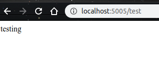
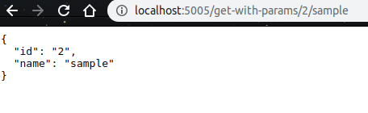
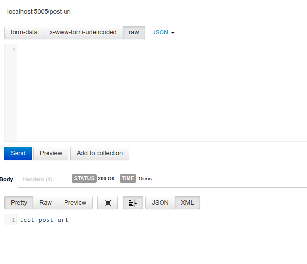
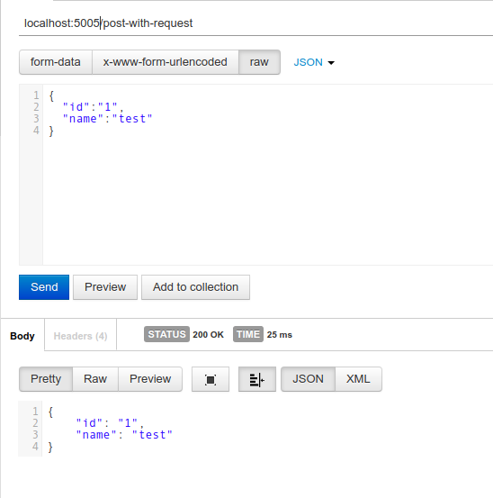

### flask-api

------

flask-app contains information about how to write API's using flask frame work in python.

It mainly discuss about How to write API's using GET and POST methods.

#### Usage

------

```
git clone https://github.com/UmaMaheswari248/flask-api.git
cd flask-api
#create conda environment using environment.yml file
conda env create -f flask_api.yml
conda activate flask_api
```

After activating conda environment we have to run application

```
python api.py
```

Now API 's are  running on port 5005 default port for flask application is 5000
we can change port of application like below

 			

```
# we can change port in api.py file
app.run(debug=True,host="0.0.0.0",port=5005)
```

in port we can give whatever port we want to give.


#### GET METHOD:

------

Syntax:

```
from flask import Flask,jsonify,request

app=Flask(__name__)

@app.route('/test')
def test_app():
    return "testing"
```

If we are not giving any methods its by default consider as GET method.

This method return string as response as below.



##### PASSING PARAMETERS IN GET METHOD:

 Syntax:					

```

@app.route('/get-with-params/<id>/<name>',methods=['GET'])
def post_get_param(id,name):
    test={
        'id':id,'name':name
    }
    return jsonify(test)
```

This method returns json response like below:



In the above example i have passed  2 as id and sample as name in get request.

#### POST METHOD:

------

Syntax:

For POST method we have mention method as post.

```
@app.route('/post-url',methods=['POST'])
def post_url():
    return "test-post-url"
```

The above API returns string response like below:



##### HANDLING REQUEST IN POST METHOD:

Syntax:

```
@app.route('/post-with-request',methods=['POST'])
def post_post_request():
    data=eval(request.data)
    test={
        'id':data['id'],
        'name':data['name']
    }
    return jsonify(test)

```

This API accepts request and gives json response like below:




#### POST AND GET METHOD FOR SAME API:

------

```
@app.route('/get-post-example',methods=['POST','GET'])
def get_post_ex():
    return "post-get-example"
```

The above API can be accessed using POST as well as GET method.


### Contribution:

------

Contributions in any form are welcome. You can contribute by reporting issues, submitting pull requests, reviewing pull requests, participating in discussions on issues and pull requests and more.